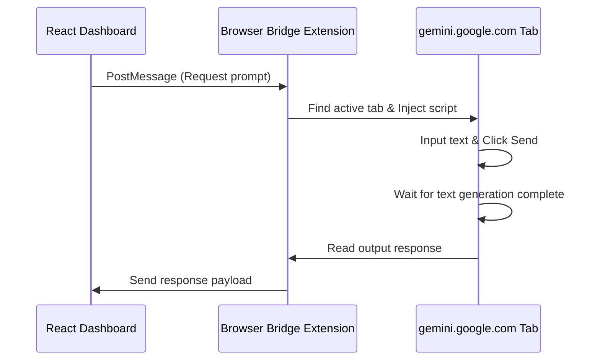

# Chrome Extension Bridge

The **Pgents Browser Bridge** is a lightweight Chrome extension that enables you to query Gemini directly from the dashboard using your free personal Google account (`gemini.google.com`) without registering for paid API keys.

---

## 🛠️ Installation

1. **Open Extension Settings:**
   Open Google Chrome and navigate to `chrome://extensions/`.
2. **Enable Developer Mode:**
   Toggle **Developer mode** in the top right corner of the page.
3. **Load Unpacked Extension:**
   Click the **Load unpacked** button in the top left.
4. **Select Folder:**
   Select the `extension/` folder located in the root of the cloned `pgents` repository.

---

## ⚙️ How It Works

1. **Tab Detection:** The extension listens for messages from `http://localhost:5173`.
2. **Text Injection:** When "Bridge Mode" is toggled on in the Navbar and a message is sent, the extension locates an open tab running `https://gemini.google.com/`.
3. **Interaction Simulation:** It writes the prompt into the input field and clicks the Send button.
4. **Scraping Responses:** Once the response stops generating, it grabs the markdown text and forwards it back to the dashboard UI.
