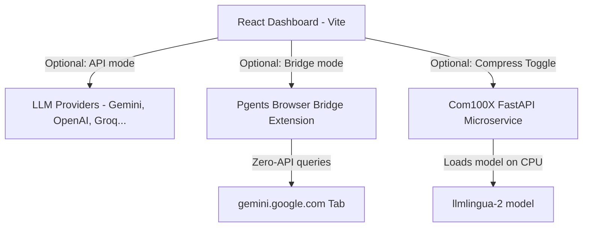

# Welcome to the Pgents Wiki

Pgents is a high-performance, multi-model React dashboard designed to orchestrate LLM workflows, manage complex system prompts (Skills), and reduce token costs through a custom hybrid compression engine.

This wiki contains comprehensive guides on installing, configuring, and running all components of the Pgents ecosystem:

## 📖 Navigation
- [[Home]] - Main Overview and Getting Started
- [[Com100X-Engine]] - Local Prompt Compression Microservice & CPU Patching
- [[Chrome-Extension-Bridge]] - Zero-API Extension Bridge Setup
- [[Preloaded-Skills]] - The 10 Deterministic AI Skills & Custom Prompts
- [[Troubleshooting-and-FAQ]] - Common Errors, Port Collisions, and Fallbacks

---

## 🚀 Getting Started

### Quick Start (Dashboard)
1. **Clone the repository:**
   ```bash
   git clone https://github.com/dpraanav558-glitch/pgents.git
   cd pgents
   ```
2. **Install frontend dependencies:**
   ```bash
   npm install
   ```
3. **Start the Vite dev server:**
   ```bash
   npm run dev
   ```
4. **Access the UI:**
   Open `http://localhost:5173` (or the port shown in your terminal) to view the dashboard.

---

## 🛠️ System Architecture

Pgents consists of three main components working in harmony:



1. **Vite Dashboard (React):** The primary user interface that includes dark/light mode, custom typography settings, local storage session persistence, and preloaded AI skills.
2. **Com100X Engine (FastAPI):** A local prompt compression microservice that uses Hugging Face models to shrink your prompts, saving context tokens and reducing LLM billing costs.
3. **Chrome Extension Bridge:** Enables querying Google Gemini directly in your browser without requiring paid API keys.
